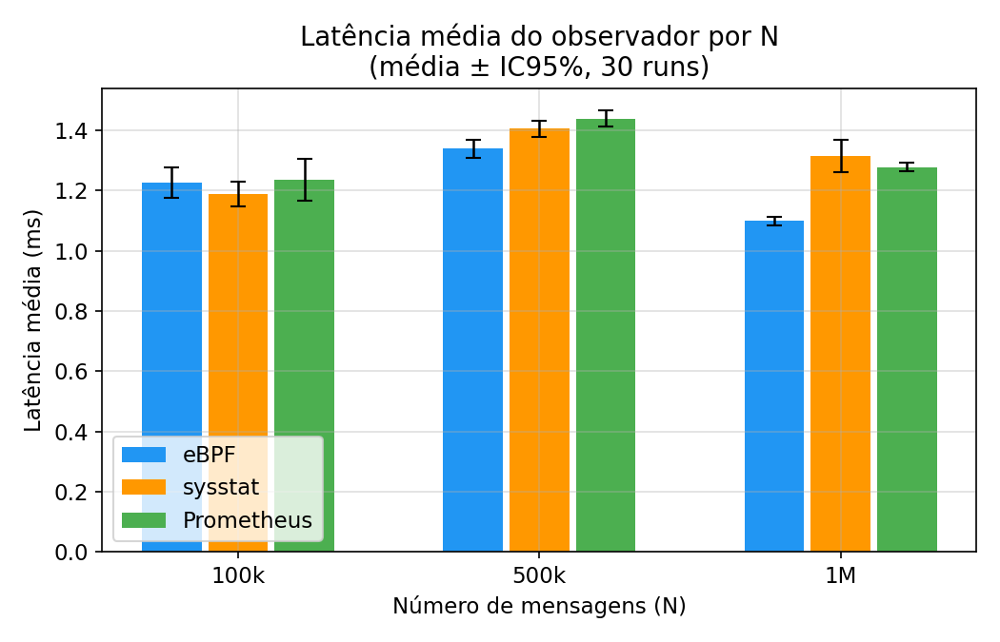
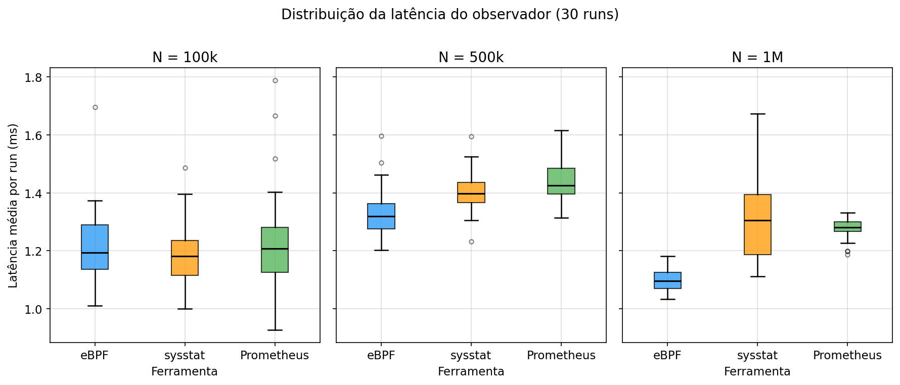

# TCC — Gerenciamento e Monitoramento de Rede (eBPF vs Clássicos)

Análise comparativa de desempenho entre três abordagens de monitoramento de rede aplicadas a uma VNF (Virtual Network Function):

1. **eBPF (libbpf+CO-RE)**: coleta no nível do kernel via kprobes (`tcp_sendmsg`, `tcp_cleanup_rbuf`), programa BPF pré-compilado com clang e carregado via `libbpf.so.1` (sem BCC/LLVM em runtime).
2. **sysstat**: polling em userspace via `/proc/net/dev`.
3. **Prometheus**: igual ao sysstat, com exposição adicional de métricas via HTTP (`:8000/metrics`).

O foco é medir o **overhead do monitoramento** (latência da coleta) ao monitorar um WAF simplificado rodando em Python.

---

## Arquitetura

```
Cliente TCP ──► WAF (porta 8080)
                      ▲
               observa via ferramenta
                      │
              Observador (UDP :9999)
              eBPF | sysstat | Prometheus
              coleta bytes RX/TX + CPU/mem do WAF
                      ▲
               probe UDP (1/s)
               mede latência de roundtrip
                      │
              <ferramenta>_<N>_run<ID>_results.json
                      │
                 compare.py
                      │
         comparison_<N>_<RUNS>runs.csv/.json
```

- O **WAF** inspeciona cada payload (SQLi, XSS, PathTraversal, RCE, NullByte) via `asyncio` + `ThreadPoolExecutor`, registra o tempo de inspeção e responde ao cliente. Protocolo: framing com 4 bytes de comprimento por mensagem (conexões persistentes).
- O **observador** coleta métricas do WAF usando a ferramenta correspondente e responde a qualquer request UDP com um JSON de métricas.
- O **probe** envia requests UDP a cada 1s e mede o tempo de roundtrip — essa latência é a métrica principal de comparação.
- A ferramenta muda entre os testes; o probe é o mesmo script (`probe.py`) nos três casos.

---

## Estrutura do Projeto

```
tcc_gerenciamento_rede/
├── src/
│   ├── probe.py                   # Probe UDP único (configurado por variáveis de ambiente)
│   ├── vnf/
│   │   ├── waf.py                 # WAF TCP (porta 8080) — SQLi, XSS, PathTraversal, RCE, NullByte
│   │   ├── observador_ebpf_libbpf.py # Observador eBPF (libbpf+CO-RE): carrega .o via ctypes, sem BCC
│   │   ├── ebpf_kern.c            # Programa BPF CO-RE (kprobes tcp_sendmsg/tcp_cleanup_rbuf)
│   │   ├── ebpf_entrypoint.sh     # Gera vmlinux.h, compila com clang, exec Python
│   │   ├── observador_ebpf.py     # Observador eBPF legado (BCC) — substituído por libbpf
│   │   ├── observador_sysstat.py  # Observador sysstat: /proc/net/dev + psutil WAF
│   │   └── observador_prometheus.py # Observador Prometheus: /proc/net/dev + psutil WAF + HTTP :8000
│   ├── client/
│   │   └── client.py              # Envia payloads pré-gerados ao WAF (asyncio, conexões persistentes)
│   └── compare.py                 # Consolida resultados em CSV e JSON (3 modos)
├── configs/
│   ├── Dockerfile                 # Imagem base Ubuntu 24.04 + BCC (legado)
│   ├── Dockerfile.ebpf-libbpf     # Imagem eBPF sem BCC: libbpf1 + clang (usada pelo stack ebpf)
│   └── Dockerfile.client          # Imagem para o cliente de tráfego
├── data/
│   └── payloads/                  # Arquivos binários de payloads pré-gerados
│       ├── payloads_100000_6040.bin
│       ├── payloads_500000_6040.bin
│       └── payloads_1000000_6040.bin
├── scripts/
│   ├── gen_payloads.py            # Gera arquivos de payloads (executar antes dos testes)
│   ├── plot_results.py            # Gera gráficos em results/plots/
│   ├── run_ebpf.sh                # Executa o teste completo com eBPF (libbpf)
│   ├── run_sysstat.sh             # Executa o teste completo com sysstat
│   ├── run_prometheus.sh          # Executa o teste completo com Prometheus
│   └── run_multi.sh               # Executa N repetições sequenciais de uma ferramenta (ebpf|sysstat|prometheus|ebpf-libbpf)
├── docs/
│   ├── architecture.md            # Documentação de arquitetura
│   ├── arquitetura_c4.svg         # Diagrama C4 da arquitetura
│   ├── main.tex                   # Documento LaTeX do TCC
│   ├── ifpr-pinhais.cls           # Classe LaTeX IFPR Pinhais
│   └── referencias.bib            # Referências bibliográficas
├── results/                       # Resultados (*_<N>_run<ID>_results.json, .csv, .json)
│   ├── plots/                     # Gráficos gerados por plot_results.py
│   └── pre_testes/                # Runs preliminares de validação
├── docker-compose.ebpf.yml            # Stack eBPF principal (libbpf+CO-RE)
├── docker-compose.ebpf-libbpf.yml    # Stack eBPF libbpf standalone (para testes isolados)
├── docker-compose.sysstat.yml
└── docker-compose.prometheus.yml
```

---

## Como Rodar

### Requisitos
- Linux nativo (kernel 6.10+, testado no 6.12).
- Docker + Docker Compose.
- Python 3.10+.
- BTF habilitado no kernel (`/sys/kernel/btf/vmlinux` — presente em kernels 5.8+).

### Passo 1 — Gerar os payloads (uma vez)

Os payloads são pré-gerados no host e montados no container do cliente:

```bash
python3 scripts/gen_payloads.py 100000   # → data/payloads/payloads_100000_6040.bin
python3 scripts/gen_payloads.py 500000   # → data/payloads/payloads_500000_6040.bin
python3 scripts/gen_payloads.py 1000000  # → data/payloads/payloads_1000000_6040.bin
```

Opções do gerador:

```bash
python3 scripts/gen_payloads.py <count> [--ratio 60] [--seed 42] [--out FILE]
# --ratio: percentual de mensagens limpas (padrão: 60 → 60% limpos / 40% maliciosos)
# --seed:  semente aleatória para reprodutibilidade (padrão: 42)
```

### Passo 2 — Executar os testes

Cada script sobe a stack completa (WAF + observador + cliente + probe), aguarda o probe finalizar via `docker wait` e exibe um resumo:

```bash
NUM_MESSAGES=100000 bash scripts/run_ebpf.sh
NUM_MESSAGES=100000 bash scripts/run_sysstat.sh
NUM_MESSAGES=100000 bash scripts/run_prometheus.sh
```

O script deriva automaticamente o arquivo de payloads a partir de `NUM_MESSAGES`. Se o arquivo não existir, o script aborta com a instrução de geração.

Variáveis de ambiente:

| Variável | Padrão | Descrição |
|---|---|---|
| `NUM_MESSAGES` | 100000 | Quantidade de mensagens — usada para DURATION e nomenclatura dos resultados |
| `DURATION` | `NUM_MESSAGES/8000 + 20` | Duração da coleta (segundos) |
| `RUN_ID` | 1 | Identificador do run |
| `WORKERS` | 200 | Conexões assíncronas do cliente (coroutines asyncio) |
| `PAYLOADS_FILE_HOST` | `data/payloads/payloads_<N>_6040.bin` | Caminho do arquivo de payloads no host (sobrescreve o padrão) |

### Passo 3 — Múltiplas repetições

```bash
bash scripts/run_multi.sh <ferramenta> <num_messages> <num_runs> [--pre]

# Exemplos:
bash scripts/run_multi.sh ebpf       100000 5
bash scripts/run_multi.sh sysstat    100000 5
bash scripts/run_multi.sh prometheus 100000 5

# Com flag --pre: salva em results/pre_testes/ (testes preliminares)
bash scripts/run_multi.sh prometheus 100000 5 --pre
```

Salva cada repetição como `<ferramenta>_<N>_run<ID>_results.json` e gera a agregação ao final.

### Gerar comparativo

```bash
python3 src/compare.py 100000        # compara 3 ferramentas para N=100000 (run 1)
python3 src/compare.py 100000 5      # agrega 5 runs de N=100000 (média ± desvio)
python3 src/compare.py               # cross-N com todos os valores disponíveis
```

---

## Métricas Coletadas

| Métrica | Origem | Descrição |
|---------|--------|-----------|
| `observador_latency_avg_ms` | probe | Latência média da roundtrip UDP (overhead do monitoramento) |
| `observador_latency_stddev_ms` | probe | Desvio padrão da latência |
| `observador_latency_max_ms` | probe | Latência máxima observada |
| `observador_samples` | probe | Número de amostras coletadas |
| `bytes_rx / bytes_tx` | observador | eBPF: kprobe sport=8080; sysstat/Prom: `/proc/net/dev` |
| `cpu_avg_pct` | observador (psutil) | Uso médio de CPU do processo WAF |
| `mem_avg_mb` | observador (psutil) | Uso médio de memória do processo WAF |
| `collector_cpu_avg_pct` | observador (psutil) | Uso médio de CPU do próprio observador |
| `collector_mem_avg_mb` | observador (psutil) | Uso médio de memória do próprio observador |
| `inspect_count` | waf → observador | Total de payloads inspecionados no run |
| `inspect_avg_ms` | waf → observador | Tempo médio de inspeção por payload (ms) |
| `inspect_min_ms` | waf → observador | Tempo mínimo de inspeção (ms) |
| `inspect_max_ms` | waf → observador | Tempo máximo de inspeção (ms) |

---

## Detalhes dos Observadores

### eBPF (`observador_ebpf_libbpf.py` + `ebpf_kern.c`)
- Programa BPF CO-RE pré-compilado com `clang` no entrypoint do container (`ebpf_entrypoint.sh`).
- Carregado em Python via `ctypes + libbpf.so.1` — sem BCC/LLVM no processo.
- `kprobe/tcp_sendmsg`: acumula bytes TX quando `sport == 8080` (respostas do WAF).
- `kprobe/tcp_cleanup_rbuf`: acumula bytes RX quando `sport == 8080` (requisições recebidas pelo WAF).
- Filtro `sport=8080` evita dupla contagem no loopback.
- Requer `privileged: true`, `pid: host`, `/sys/kernel/debug`, `/sys/kernel/btf`.

### sysstat (`observador_sysstat.py`)
- Lê `/proc/net/dev` (interface `lo`) a cada request UDP recebido.
- Retorna delta de bytes RX/TX em relação ao início do teste.
- Requer `pid: host`.

### Prometheus (`observador_prometheus.py`)
- Mesma lógica de coleta do sysstat.
- Expõe Gauges em `:8000/metrics` via `prometheus_client`.
- Bind do UDP :9999 feito antes do HTTP :8000 para evitar falha por TIME_WAIT entre runs.
- Requer `pid: host`.

---

## Resultados

> Valores exibidos como **média ± IC95%** (intervalo de confiança de 95%, t de Student, α=0.05).

### N = 100.000 mensagens — 30 runs (28/04/2026, libbpf)

| Métrica | eBPF | sysstat | Prometheus |
|---------|------|---------|------------|
| Latência média (ms) | **1.1435 ± 0.0272** | 1.1876 ± 0.0414 | 1.2348 ± 0.0690 |
| Desvio padrão (ms) | **0.6899 ± 0.0790** | 0.8323 ± 0.1306 | 0.8647 ± 0.1148 |
| Latência máx (ms) | **4.1619 ± 0.4504** | 5.2487 ± 0.8089 | 5.0872 ± 0.6464 |
| Latência mín (ms) | 0.3247 ± 0.0175 | 0.5265 ± 0.0226 | **0.4997 ± 0.0332** |
| CPU média WAF (%) | **68.635 ± 3.7482** | 70.008 ± 0.1606 | 68.356 ± 3.2806 |
| Memória média WAF (MB) | **12.181 ± 0.0219** | 12.155 ± 0.0200 | 12.220 ± 0.0206 |
| CPU média observador (%) | 3.320 ± 6.6202 | 2.860 ± 4.2246 | **1.402 ± 1.8656** |
| Memória média observador (MB) | 15.050 ± 0.0360 | **13.689 ± 0.0292** | 24.559 ± 0.0563 |

**Observações:**
- As três ferramentas apresentam latências próximas — IC95 com sobreposição parcial em N=100k.
- **CPU do observador** com IC95 superior à média nas três ferramentas, refletindo alta variância em runs curtos (~43s).
- **Memória do observador**: eBPF libbpf ~15 MB (sem BCC/LLVM), comparável ao sysstat ~14 MB. Prometheus ~25 MB.

### N = 500.000 mensagens — 30 runs (27/04/2026, BCC — re-execução com libbpf pendente)

| Métrica | eBPF | sysstat | Prometheus |
|---------|------|---------|------------|
| Latência média (ms) | **1.3380 ± 0.0309** | 1.4053 ± 0.0267 | 1.4381 ± 0.0265 |
| Desvio padrão (ms) | **0.9469 ± 0.0861** | 1.0322 ± 0.0748 | 1.0469 ± 0.0772 |
| Latência máx (ms) | 7.7065 ± 1.0172 | 7.8964 ± 0.8772 | **7.7276 ± 0.9048** |
| Latência mín (ms) | **0.4412 ± 0.0264** | 0.5098 ± 0.0118 | 0.5102 ± 0.0106 |
| CPU média WAF (%) | 72.134 ± 0.176 | 68.301 ± 0.222 | **67.452 ± 0.225** |
| Memória média WAF (MB) | **12.197 ± 0.025** | 12.198 ± 0.022 | 12.210 ± 0.018 |
| CPU média observador (%) | **0.709 ± 0.876** | 0.749 ± 0.942 | 0.978 ± 1.045 |
| Memória média observador (MB) | 196.712 ± 0.318 | **13.639 ± 0.024** | 24.606 ± 0.054 |

Em N=500k o eBPF apresenta menor latência média com IC95 que não se sobrepõem aos demais — diferença estatisticamente significativa.

### N = 1.000.000 mensagens — 30 runs (27/04/2026, BCC — re-execução com libbpf pendente)

| Métrica | eBPF | sysstat | Prometheus |
|---------|------|---------|------------|
| Latência média (ms) | **1.1016 ± 0.0140** | 1.3141 ± 0.0548 | 1.2765 ± 0.0143 |
| Desvio padrão (ms) | **0.7118 ± 0.0324** | 0.8379 ± 0.0693 | 0.7442 ± 0.0347 |
| Latência máx (ms) | **6.0817 ± 0.2919** | 7.3840 ± 0.8908 | 6.5889 ± 0.5932 |
| Latência mín (ms) | 0.3854 ± 0.0140 | **0.3333 ± 0.0299** | 0.5218 ± 0.0461 |
| CPU média WAF (%) | **65.1473 ± 0.2609** | 65.894 ± 0.5843 | 70.1823 ± 0.5326 |
| Memória média WAF (MB) | 12.2693 ± 0.0206 | **12.239 ± 0.0270** | 12.2963 ± 0.0230 |
| CPU média observador (%) | 0.2943 ± 0.4334 | **0.1693 ± 0.1468** | 0.2753 ± 0.2461 |
| Memória média observador (MB) | 196.5243 ± 0.2452 | **13.6733 ± 0.0364** | 24.5493 ± 0.0494 |

**Observações:**
- Em N=1M o eBPF confirma menor latência média (1.098 ms vs. 1.276–1.314 ms) com IC95 sem sobreposição — vantagem estatisticamente significativa.
- **Desvio padrão e latência máx** também menores no eBPF, indicando menor variabilidade além da média.
- **Latência mínima**: sysstat apresenta o menor valor (0.333 ms), mas com IC95 mais amplo que o eBPF.
- **CPU do WAF**: Prometheus consome significativamente mais CPU (~70%) enquanto eBPF e sysstat ficam próximos (~65%).
- **Memória do observador**: eBPF ~196 MB (dados BCC — será atualizado após re-execução com libbpf), sysstat ~13 MB, Prometheus ~24 MB.

### Gráficos (28/04/2026)

> Gerados por `scripts/plot_results.py` a partir das médias de 30 runs. Salvos em `results/plots/`.

**Latência média do observador por N** — evidencia que eBPF se destaca em N=500k e N=1M com IC95 sem sobreposição:



**Distribuição de latência por run** — boxplot das 30 runs mostra que eBPF tem menor variabilidade em N=1M:



**Memória do observador** — com libbpf o eBPF cai de ~196 MB (BCC) para ~15 MB, ficando comparável ao sysstat (~13 MB):


**CPU média do WAF** — Prometheus apresenta maior CPU do WAF em N=1M (~70%), reflexo do overhead do endpoint HTTP sob carga contínua:


