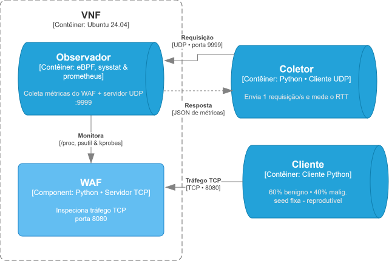
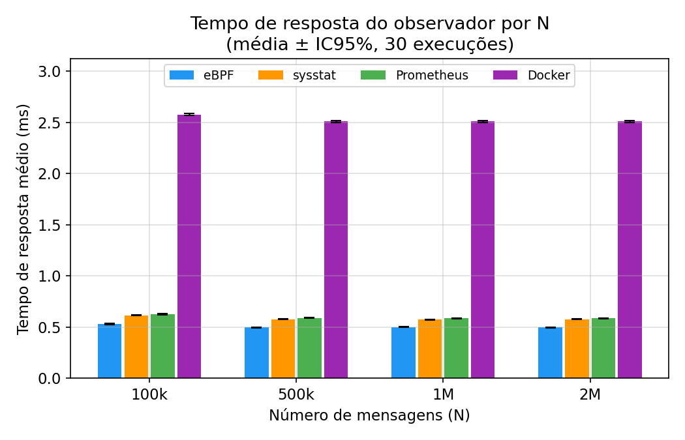

<h1 align="center">vnf-monitoring-benchmark</h1>

<p align="center">
  <b>Quanto custa monitorar uma função de rede virtualizada?</b><br>
  Comparação de desempenho entre <b>eBPF</b>, <b>Sysstat</b>, <b>Prometheus</b> e <b>API do Docker</b> aplicados a um WAF.
</p>

<p align="center">
  
  
  
  
  
</p>

<p align="center">
  <a href="#como-funciona">Como funciona</a> ·
  <a href="#início-rápido">Início rápido</a> ·
  <a href="#estrutura-do-repositório">Estrutura</a> ·
  <a href="#resultados">Resultados</a> ·
  <a href="#limitações">Limitações</a> ·
  <a href="#sobre-o-trabalho">Sobre o trabalho</a>
</p>

---

Benchmark reprodutível que mede o **overhead de quatro abordagens de monitoramento** enquanto um WAF simplificado processa carga:

| Abordagem | Como coleta |
|---|---|
| **eBPF** (libbpf + CO-RE) | kprobes no kernel (`tcp_sendmsg`, `tcp_cleanup_rbuf`), sem BCC/LLVM em runtime |
| **Sysstat** | leitura em espaço de usuário de `/proc/net/dev` |
| **Prometheus** | igual ao Sysstat, com um endpoint HTTP `/metrics` ativo |
| **Docker** | `container.stats()` da API do Docker (cgroups) pelo SDK Python, via `/var/run/docker.sock` |

A métrica principal é o **tempo de resposta do observador**: o RTT de um probe UDP mostra quanto tempo cada ferramenta leva para entregar suas métricas. CPU e memória do WAF e do observador são métricas secundárias.

## Como funciona

<p align="center">
  
</p>

- O **cliente** envia payloads pré-gerados (60% benignos, 40% maliciosos) ao **WAF** por conexões TCP persistentes.
- O **WAF** inspeciona cada payload (SQLi, XSS, Path Traversal, RCE, Null Byte) com `asyncio` + `ThreadPoolExecutor`.
- O **observador** coleta métricas do WAF com a ferramenta em teste e responde a requisições UDP com um JSON.
- O **probe** envia uma requisição UDP por segundo e mede o RTT. O mesmo script é usado nas quatro ferramentas.

> [!NOTE]
> O RTT mede o tempo que o *observador* leva para responder. O impacto sobre o *WAF* é avaliado pela CPU e pela memória do WAF.

## Início rápido

Requer Linux nativo com BTF (`/sys/kernel/btf/vmlinux`), Docker Compose e Python 3.10+.

```bash
git clone https://github.com/joaopedroplinta/vnf-monitoring-benchmark.git
cd vnf-monitoring-benchmark
pip install matplotlib numpy

python3 scripts/gen_payloads.py 100000            # gera os payloads (uma vez)
NUM_MESSAGES=100000 bash scripts/run_ebpf.sh
NUM_MESSAGES=100000 bash scripts/run_sysstat.sh
NUM_MESSAGES=100000 bash scripts/run_prometheus.sh
NUM_MESSAGES=100000 bash scripts/run_docker.sh
python3 src/compare.py 100000                     # compara as quatro ferramentas
```

A bateria completa (30 execuções por ferramenta e volume, ~14 h) e as variáveis de ambiente estão em **[docs/reproducao.md](docs/reproducao.md)**.

## Estrutura do repositório

| Pasta | Conteúdo |
|---|---|
| [`src/`](src) | WAF, observadores (eBPF, Sysstat, Prometheus, Docker), cliente, probe e comparador |
| [`scripts/`](scripts) | geração de payloads, execução dos testes e gráficos |
| [`configs/`](configs) | Dockerfiles |
| [`dashboard/`](dashboard) | dashboard interativo (Streamlit) com os resultados das 480 execuções |
| [`results/`](results) | resultados brutos (JSON) e agregados (CSV/JSON) das execuções |
| [`docs/`](docs) | tese em LaTeX, diagrama C4, apresentações e documentação detalhada |

## Dashboard

Os resultados podem ser explorados em um dashboard interativo (Streamlit + Plotly), com filtros por ferramenta e volume, IC95%, execuções individuais, download dos dados e modo claro/escuro:

```bash
cd dashboard
python3 -m venv .venv
.venv/bin/pip install -r requirements.txt
.venv/bin/streamlit run app.py
```

Abra `http://localhost:8501`. Detalhes, testes e instruções de hospedagem na Railway em **[dashboard/README.md](dashboard/README.md)**.

Documentação detalhada:
[Reprodução](docs/reproducao.md) ·
[Resultados](docs/resultados.md) ·
[Métricas e observadores](docs/metricas-e-observadores.md) ·
[Arquitetura](docs/architecture.md) ·
[Diário do projeto](relatorio_projeto.md)

## Resultados

480 execuções (4 ferramentas × 4 volumes × 30 repetições), com média ± IC95%, no kernel 7.0.0-38 em modo texto.

**Tempo de resposta médio do observador (ms, menor é melhor):**

| Volume de mensagens | eBPF | Sysstat | Prometheus | Docker |
|---|:---:|:---:|:---:|:---:|
| 100.000 | **0,531** | 0,614 | 0,625 | 2,577 |
| 500.000 | **0,497** | 0,576 | 0,589 | 2,507 |
| 1.000.000 | **0,499** | 0,574 | 0,587 | 2,508 |
| 2.000.000 | **0,497** | 0,576 | 0,587 | 2,508 |

- O **eBPF teve o menor tempo de resposta nos quatro volumes**, com IC95 sem sobreposição. A vantagem é de 13% a 16% sobre Sysstat e Prometheus e de ~80% sobre o Docker, cujo RTT (~2,5 ms) inclui a consulta ao daemon.
- **Memória do observador:** Sysstat ~14 MB, eBPF ~15 MB, Prometheus ~25 MB (o custo do servidor HTTP), Docker ~31 MB.
- **CPU do WAF** equivalente entre as ferramentas. **CPU do observador** inconclusiva.

<p align="center">
  
</p>

Tabelas completas por volume, gráficos e observações: **[docs/resultados.md](docs/resultados.md)**.

## Limitações

- **Loopback:** o tráfego passa pela interface `lo`, sem o overhead de drivers de NIC físico; valores absolutos seriam diferentes em rede real.
- **Recursos compartilhados:** cliente, WAF e observador dividem kernel e núcleos de CPU.
- **WAF simplificado:** implementação em Python, idêntica em todos os experimentos, então as diferenças refletem o custo de cada ferramenta.
- **Volume nominal:** para N ≥ 500k o WAF processa só 62% a 87% de N; veja [resultados](docs/resultados.md#n-nominal--mensagens-processadas).
- **Lotes não intercalados:** cada combinação ferramenta × volume foi coletada em sequência, o que mistura a ferramenta com o estado da máquina naquele momento.
- **Docker:** memória e CPU do WAF vêm do cgroup, não do processo, e não são comparáveis às das demais ferramentas; o socket do Docker exige privilégio.
- **Prometheus sem scraping:** é avaliado só como exporter; nenhum servidor consulta o endpoint durante os testes.

## Sobre o trabalho

Trabalho de Conclusão de Curso do Bacharelado em Ciência da Computação, IFPR Campus Pinhais (2026).

> **Monitoramento de Funções Virtualizadas de Redes: um estudo comparativo entre ferramentas de extração de comportamento**

| | |
|---|---|
| **Autores** | João Pedro dos Santos Henrique Plinta · Rafael Correia Alves |
| **Orientador** | Prof. Guilherme Werneck de Oliveira |

O texto da tese está em [`docs/`](docs) (LaTeX) e é compilado no Overleaf: o `docs/main.tex` referencia `capítulos/` com nomes acentuados e os logotipos não estão versionados, então a pasta não compila sozinha. Slides e roteiros estão em [`docs/apresentacao/`](docs/apresentacao).

## Licença

[MIT](LICENSE) © 2026 João Pedro dos Santos Henrique Plinta e Rafael Correia Alves.
