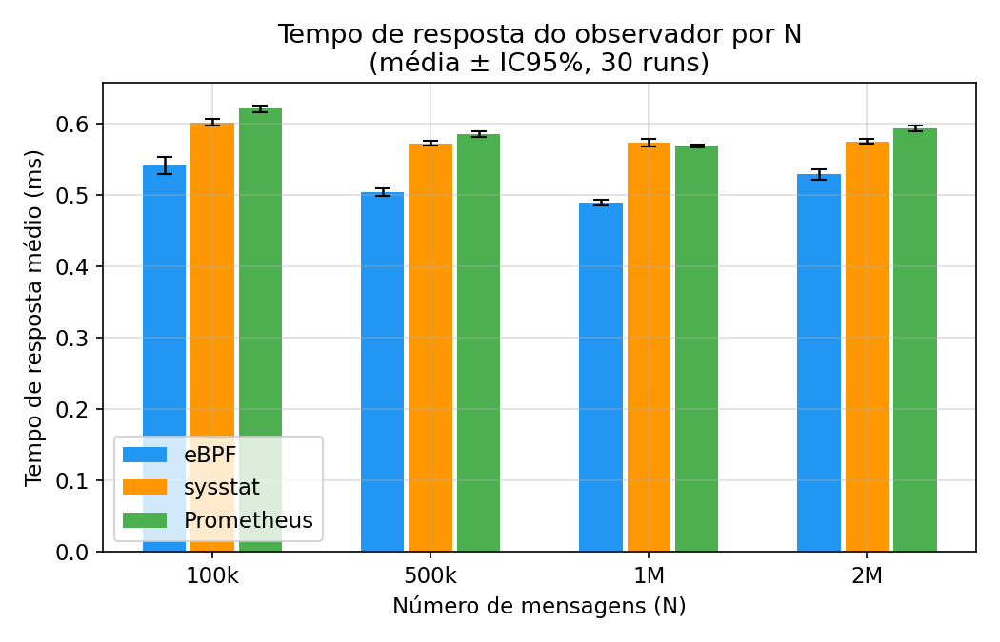
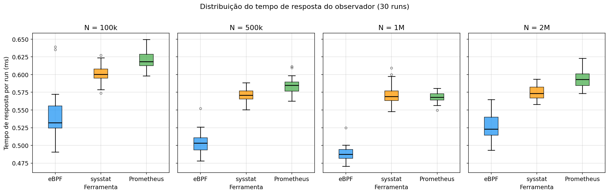
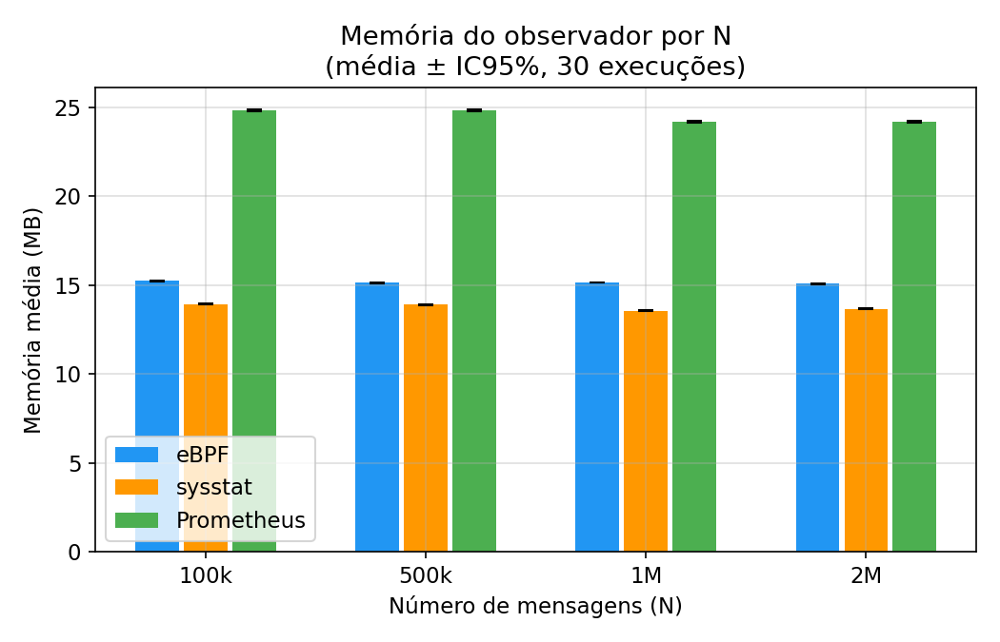
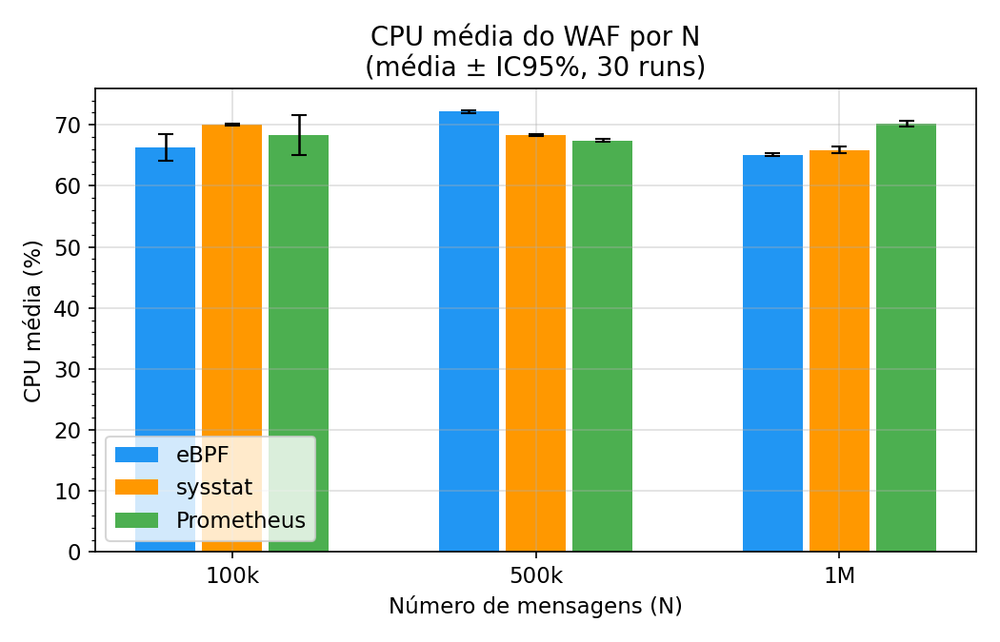

# Resultados

360 execuções: 3 ferramentas × 4 volumes × 30 repetições, coletadas em 16–18/05/2026 (WORKERS=200, libbpf+CO-RE).

Valores exibidos como **média ± IC95%** (intervalo de confiança de 95%, t de Student, α=0,05). Em **negrito**, o menor valor médio de cada linha; isso não significa diferença estatisticamente significativa (veja as [observações](#observações)).

## Comparativo cross-N — tempo de resposta médio (ms)

| N | eBPF | sysstat | Prometheus |
|---|------|---------|------------|
| 100.000 | **0.5407** | 0.6012 | 0.6205 |
| 500.000 | **0.5038** | 0.5721 | 0.5844 |
| 1.000.000 | **0.4885** | 0.5725 | 0.5682 |
| 2.000.000 | **0.5283** | 0.5746 | 0.5932 |

## N nominal × mensagens processadas

O volume N é o tamanho nominal do arquivo de payloads. Cada execução termina após `DURATION` segundos, e a vazão real do WAF é ~7,5 mil msg/s (menor que os 15 mil msg/s assumidos na fórmula). Por isso o WAF processa só uma fração de N nos volumes maiores (média de `inspect_count` por execução):

| N nominal | eBPF | sysstat | Prometheus |
|---|---|---|---|
| 100.000 | 100.000 (100%) | 100.000 (100%) | 100.000 (100%) |
| 500.000 | 405.313 (81%) | 384.682 (77%) | 384.690 (77%) |
| 1.000.000 | 674.607 (67%) | 629.103 (63%) | 652.167 (65%) |
| 2.000.000 | 1.083.740 (54%) | 1.114.290 (56%) | 1.102.603 (55%) |

> Execuções com `inspect_count = 0` (5 das 360, por uma condição de corrida na leitura de `waf_metrics.json`) foram excluídas desta tabela. O tempo de resposta UDP dessas execuções é válido e entra nas médias.

## Resultados por volume

### N = 100.000

DURATION ≈ 26 s, 26 amostras por execução.

| Métrica | eBPF | sysstat | Prometheus |
|---------|------|---------|------------|
| Tempo de resposta médio (ms) | **0.5407 ± 0.0121** | 0.6012 ± 0.0048 | 0.6205 ± 0.0046 |
| Desvio padrão (ms) | 0.0808 ± 0.0064 | **0.0797 ± 0.0048** | 0.0878 ± 0.0065 |
| CPU média WAF (%) | **52.385 ± 7.283** | 57.230 ± 0.200 | 57.044 ± 0.158 |
| Memória média WAF (MB) | 28.955 ± 0.083 | **28.106 ± 0.045** | 28.122 ± 0.046 |
| CPU média observador (%) | **0.051 ± 0.010** | 4.663 ± 6.543 | 2.373 ± 4.720 |
| Memória média observador (MB) | 15.226 ± 0.020 | **13.932 ± 0.015** | 24.822 ± 0.040 |

### N = 500.000

DURATION ≈ 53 s, 53 amostras por execução.

| Métrica | eBPF | sysstat | Prometheus |
|---------|------|---------|------------|
| Tempo de resposta médio (ms) | **0.5038 ± 0.0055** | 0.5721 ± 0.0034 | 0.5844 ± 0.0042 |
| Desvio padrão (ms) | 0.0669 ± 0.0258 | **0.0587 ± 0.0028** | 0.0598 ± 0.0028 |
| CPU média WAF (%) | **107.02 ± 0.049** | 107.40 ± 0.052 | 107.42 ± 0.047 |
| Memória média WAF (MB) | 37.527 ± 0.118 | 36.454 ± 0.094 | **36.426 ± 0.095** |
| CPU média observador (%) | 3.515 ± 3.976 | **1.152 ± 2.244** | 3.484 ± 5.227 |
| Memória média observador (MB) | 15.125 ± 0.023 | **13.907 ± 0.023** | 24.831 ± 0.045 |

### N = 1.000.000

DURATION ≈ 87 s, 86 amostras por execução.

| Métrica | eBPF | sysstat | Prometheus |
|---------|------|---------|------------|
| Tempo de resposta médio (ms) | **0.4885 ± 0.0039** | 0.5725 ± 0.0053 | 0.5682 ± 0.0026 |
| Desvio padrão (ms) | 0.0547 ± 0.0084 | 0.0760 ± 0.0187 | **0.0569 ± 0.0021** |
| CPU média WAF (%) | **107.985 ± 0.051** | 108.093 ± 0.088 | 108.219 ± 0.039 |
| Memória média WAF (MB) | 44.602 ± 0.250 | **42.750 ± 0.280** | 43.348 ± 0.182 |
| CPU média observador (%) | 0.819 ± 1.578 | 1.423 ± 1.945 | **0.742 ± 1.398** |
| Memória média observador (MB) | 15.138 ± 0.017 | **13.551 ± 0.028** | 24.164 ± 0.058 |

### N = 2.000.000

DURATION ≈ 153 s, 153 amostras por execução.

| Métrica | eBPF | sysstat | Prometheus |
|---------|------|---------|------------|
| Tempo de resposta médio (ms) | **0.5283 ± 0.0070** | 0.5746 ± 0.0037 | 0.5932 ± 0.0042 |
| Desvio padrão (ms) | 0.0850 ± 0.0151 | **0.0626 ± 0.0060** | 0.0621 ± 0.0022 |
| CPU média WAF (%) | **107.958 ± 1.155** | 108.848 ± 0.068 | 108.671 ± 0.078 |
| Memória média WAF (MB) | **49.891 ± 0.643** | 53.869 ± 0.373 | 53.485 ± 0.447 |
| CPU média observador (%) | 0.471 ± 0.867 | **0.461 ± 0.836** | 0.801 ± 1.053 |
| Memória média observador (MB) | 15.066 ± 0.022 | **13.660 ± 0.025** | 24.197 ± 0.051 |

## Observações

- **Tempo de resposta:** o eBPF lidera nos quatro volumes, com IC95 sem sobreposição em relação ao sysstat e ao Prometheus. A vantagem é de 8% a 15%, com maior dispersão entre execuções.
- **Subida de 1M para 2M:** o tempo de resposta do eBPF sobe (0,489 → 0,528 ms) e a vantagem sobre o sysstat encolhe de 85 µs para 47 µs. Causa não determinada; veja a seção "Revisão do texto da tese e análise dos dados (23/09/2026)" em [`relatorio_projeto.md`](../relatorio_projeto.md).
- **CPU do observador é inconclusiva:** o eBPF só tem a menor média em N=100k, e mesmo ali os IC95 do sysstat e do Prometheus incluem o valor dele. Nos demais volumes as ferramentas empatam ou o eBPF fica acima.
- **Memória do observador:** sysstat ~14 MB, eBPF ~15 MB (libbpf, sem BCC/LLVM), Prometheus ~24 MB, estável em todos os volumes.
- **CPU do WAF:** equivalente entre as ferramentas; a partir de 500k o WAF satura em torno de 107–109%.
- **Memória do WAF** cresce com o volume processado (28 MB em 100k → 50 MB em 2M), com o mesmo comportamento nas três ferramentas.

## Gráficos

Gerados por `scripts/plot_results.py` a partir das médias das 30 execuções (arquivos em `results/plots/`).

