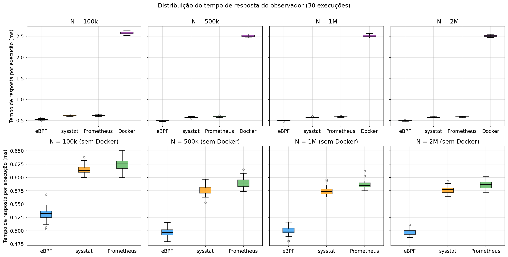
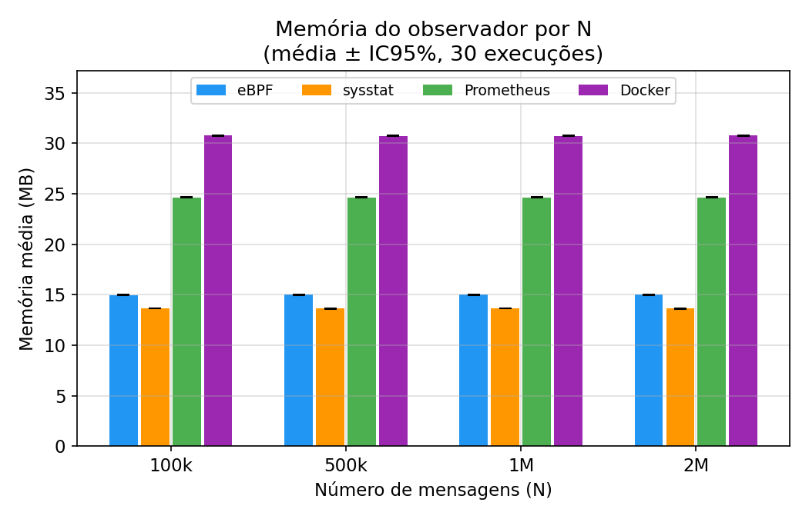
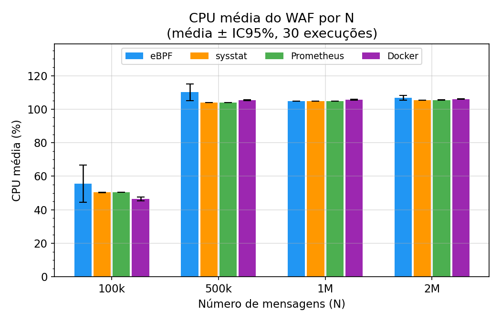

# Resultados

480 execuções: 4 ferramentas × 4 volumes × 30 repetições, coletadas em 07–08/10/2026 (kernel 7.0.0-38, Docker Engine 29.8.2, modo texto, WORKERS=200, libbpf+CO-RE). A coleta anterior (kernel 7.0.0-15, 360 execuções sem o Docker) está arquivada em [`results/arquivo_kernel15/`](../results/arquivo_kernel15).

Valores exibidos como **média ± IC95%** (intervalo de confiança de 95%, t de Student, α=0,05). Em **negrito**, o menor valor médio de cada linha; isso não significa diferença estatisticamente significativa (veja as [observações](#observações)).

## Comparativo cross-N — tempo de resposta médio (ms)

| N | eBPF | sysstat | Prometheus | Docker |
|---|------|---------|------------|--------|
| 100.000 | **0.5310** | 0.6144 | 0.6246 | 2.5767 |
| 500.000 | **0.4973** | 0.5758 | 0.5892 | 2.5071 |
| 1.000.000 | **0.4993** | 0.5744 | 0.5867 | 2.5084 |
| 2.000.000 | **0.4971** | 0.5762 | 0.5869 | 2.5083 |

## N nominal × mensagens processadas

O volume N é o tamanho nominal do arquivo de payloads. Cada execução termina após `DURATION` segundos, e a vazão real do WAF é menor que os 15 mil msg/s assumidos na fórmula. Por isso o WAF processa só uma fração de N nos volumes maiores (média de `inspect_count` por execução, a partir da última amostra válida):

| N nominal | eBPF | sysstat | Prometheus | Docker |
|---|---|---|---|---|
| 100.000 | 100.000 (100%) | 100.000 (100%) | 100.000 (100%) | 100.000 (100%) |
| 500.000 | 436.700 (87%) | 420.390 (84%) | 418.077 (84%) | 431.117 (86%) |
| 1.000.000 | 704.960 (70%) | 688.440 (69%) | 687.147 (69%) | 701.147 (70%) |
| 2.000.000 | 1.249.940 (62%) | 1.231.470 (62%) | 1.234.027 (62%) | 1.247.390 (62%) |

> Em 106 das 480 execuções (N ≥ 500k) o resumo veio com `inspect_count = 0` por uma condição de corrida na leitura de `waf_metrics.json` (o WAF gravava o arquivo sem escrita atômica). Os campos `inspect_*` desses resumos foram recalculados a partir da última amostra válida (`scripts/fix_inspect.py`); as demais métricas não são afetadas. A correção do WAF (commit `c7b305e`) vale para coletas futuras.

## Resultados por volume

### N = 100.000

DURATION ≈ 26 s, 26 amostras por execução.

| Métrica | eBPF | sysstat | Prometheus | Docker |
|---------|------|---------|------------|--------|
| Tempo de resposta médio (ms) | **0.5310 ± 0.0046** | 0.6144 ± 0.0033 | 0.6246 ± 0.0046 | 2.5767 ± 0.0101 |
| Desvio padrão (ms) | **0.0624 ± 0.0033** | 0.0731 ± 0.0036 | 0.0755 ± 0.0030 | 0.2136 ± 0.0111 |
| CPU média WAF (%) | 55.586 ± 11.205 | 50.388 ± 0.112 | 50.432 ± 0.074 | **46.377 ± 1.152** |
| Memória média WAF (MB) | 28.894 ± 0.091 | 28.209 ± 0.065 | 28.159 ± 0.097 | **20.660 ± 0.125** |
| CPU média observador (%) | **0.041 ± 0.009** | 4.860 ± 6.868 | 0.067 ± 0.009 | 1.333 ± 1.741 |
| Memória média observador (MB) | 14.985 ± 0.016 | **13.603 ± 0.020** | 24.620 ± 0.046 | 30.764 ± 0.050 |

### N = 500.000

DURATION ≈ 53 s, 53 amostras por execução.

| Métrica | eBPF | sysstat | Prometheus | Docker |
|---------|------|---------|------------|--------|
| Tempo de resposta médio (ms) | **0.4973 ± 0.0032** | 0.5758 ± 0.0038 | 0.5892 ± 0.0036 | 2.5071 ± 0.0092 |
| Desvio padrão (ms) | **0.0515 ± 0.0020** | 0.0588 ± 0.0023 | 0.0679 ± 0.0159 | 0.1787 ± 0.0109 |
| CPU média WAF (%) | 110.076 ± 5.060 | 104.030 ± 0.028 | **104.019 ± 0.031** | 105.382 ± 0.392 |
| Memória média WAF (MB) | 36.468 ± 0.178 | 35.693 ± 0.162 | 35.491 ± 0.171 | **29.816 ± 0.275** |
| CPU média observador (%) | 1.380 ± 2.730 | 2.403 ± 3.344 | **0.060 ± 0.003** | 1.954 ± 1.406 |
| Memória média observador (MB) | 14.967 ± 0.020 | **13.609 ± 0.019** | 24.639 ± 0.047 | 30.804 ± 0.042 |

### N = 1.000.000

DURATION ≈ 86 s, 86 amostras por execução.

| Métrica | eBPF | sysstat | Prometheus | Docker |
|---------|------|---------|------------|--------|
| Tempo de resposta médio (ms) | **0.4993 ± 0.0031** | 0.5744 ± 0.0030 | 0.5867 ± 0.0028 | 2.5084 ± 0.0103 |
| Desvio padrão (ms) | **0.0512 ± 0.0021** | 0.0574 ± 0.0025 | 0.0577 ± 0.0020 | 0.1678 ± 0.0071 |
| CPU média WAF (%) | 104.898 ± 0.012 | **104.885 ± 0.032** | 104.899 ± 0.021 | 105.657 ± 0.240 |
| Memória média WAF (MB) | 40.769 ± 0.316 | 40.125 ± 0.338 | 39.993 ± 0.300 | **34.312 ± 0.303** |
| CPU média observador (%) | **0.042 ± 0.004** | 0.823 ± 1.573 | 0.842 ± 1.598 | 0.500 ± 0.780 |
| Memória média observador (MB) | 14.974 ± 0.023 | **13.611 ± 0.020** | 24.617 ± 0.044 | 30.795 ± 0.046 |

### N = 2.000.000

DURATION ≈ 153 s, 153 amostras por execução.

| Métrica | eBPF | sysstat | Prometheus | Docker |
|---------|------|---------|------------|--------|
| Tempo de resposta médio (ms) | **0.4971 ± 0.0022** | 0.5762 ± 0.0024 | 0.5869 ± 0.0029 | 2.5083 ± 0.0079 |
| Desvio padrão (ms) | **0.0505 ± 0.0043** | 0.0541 ± 0.0017 | 0.0553 ± 0.0020 | 0.1679 ± 0.0141 |
| CPU média WAF (%) | 106.750 ± 1.452 | **105.475 ± 0.016** | 105.489 ± 0.018 | 106.021 ± 0.132 |
| Memória média WAF (MB) | 46.403 ± 0.443 | 46.699 ± 0.489 | 45.978 ± 0.594 | **40.305 ± 0.529** |
| CPU média observador (%) | **0.048 ± 0.001** | 1.360 ± 1.491 | 0.477 ± 0.853 | 0.338 ± 0.314 |
| Memória média observador (MB) | 14.991 ± 0.019 | **13.606 ± 0.021** | 24.665 ± 0.045 | 30.770 ± 0.044 |

## Observações

- **Tempo de resposta:** o eBPF lidera nos quatro volumes, com IC95 sem sobreposição em relação às demais: 13–14% abaixo do sysstat, 15–16% abaixo do Prometheus e ~80% abaixo do Docker. Sysstat e Prometheus também ficam separados (1,6% a 2,3%).
- **Docker:** ~2,5 ms, cerca de cinco vezes o eBPF. A consulta ao daemon (socket Unix → dockerd → cgroup → JSON) está dentro do RTT medido; a decomposição desse tempo não foi medida. Alternativas (ler `/sys/fs/cgroup` direto, cache em segundo plano) não foram avaliadas.
- **N=100k:** todos os coletores têm RTT maior que nos demais volumes; a partir de 500k o RTT é praticamente constante.
- **CPU do observador é inconclusiva:** médias baixas com desvios muito altos; os IC95 do sysstat, do Prometheus e do Docker são da ordem da média ou incluem o valor do eBPF.
- **Memória do observador:** sysstat ~14 MB, eBPF ~15 MB (libbpf, sem BCC/LLVM), Prometheus ~25 MB, Docker ~31 MB, estável em todos os volumes.
- **CPU do WAF:** equivalente entre as ferramentas; a partir de 500k o WAF satura em torno de 104–110%. No Docker a CPU vem do cgroup, não do psutil.
- **Memória do WAF:** no Docker é a do cgroup (`usage − inactive_file`), ~6–8 MB abaixo do RSS das demais; não é comparável.
- **Bytes RX/TX:** eBPF mede só o tráfego da porta 8080; sysstat, Prometheus e Docker medem todo o `lo` (via `/proc/net/dev`); servem só para caracterização.

## Gráficos

Gerados por `scripts/plot_results.py` a partir das médias das 30 execuções (arquivos em `results/plots/`).

